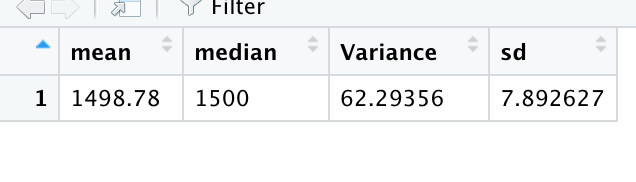

## Linear Regression to Predict MPG

- Which variables/coefficients provided a non-random amount of variance to the mpg values in the dataset?

vehicle length, ground clearance and AWD

- Is the slope of the linear model considered to be zero? Why or why not?

The slopes of the linear model of vehicle weight and spoiler angle are nearly zero, because P-values (probability values) for the above variables are smaller than our significance level of 0.05. they do not impact the miles per gallon.

- Does this linear model predict mpg of MechaCar prototypes effectively? Why or why not?

This linear model does predict effectively, because according to the summary output, the r-squared value is 0.71, which predicts that approximatley 71% of all mpg predictions will be correct when using this linear model.

## Summary Statistics on Suspension Coils

  The design specifications for the MechaCar suspension coils dictate that the variance of the suspension coils must not exceed 100 pounds per square inch (PSI). Does the current manufacturing data meet this design specification for all manufacturing lots in total and each lot individually? Why or why not?
   
- The design specifications for the MechaCar suspension coils dictate that the variance of the suspension coils must not exceed 100 pounds per square inch. According to the Picture below, all the manufacturing lots have a mean of 1499 with a variance of 62.3.The number is less than 100 so they meet the design specification.

    
 
- On the lot level, Lot 1 and 2 have a mean of 1500 and a variance of 1.0 and 7.5, Lot 3 has a mean of 1496 with a variance of 170.3 So Lot 1 and Lot 2 meet the design specification and Lot 3 does not.

## T-Tests on Suspension Coils

If we define our significance level is the common 0.05 percent, our p-value of 0.069 is above the significance level. Therefore, we do not have sufficient evidence to reject the null hypothesis

For Lot 1, the p-value is 1, indicating a very high probability for the null hypothesis.

For Lot 2, the p-value is 61% for the null hypothesis.

For Lot 3, the p-value is 4.2%. the null hypothesis is rejected

## Study Design: MechaCar vs Competition
Examples of metrics of interest to the consumer may be HP, cost, or fuel efficiency.

What metric or metrics are you going to test?

- Horse Power.  

What is the null hypothesis or alternative hypothesis? 

- The null hypothesis would be that high Horse Power vehicles will cost more than the average manufacturers.
  
What statistical test would you use to test the hypothesis? And why?
- Locate the mean cost of all manufacturers. 
- Select the vehicles with a cost higher than the mean cost. 
- Perform a t-test of those vehicle's HP against against all vehicle's. If the hypothesis is true then a high p-value would indicate that greater HP have a higher cost, which would support the null hypothesis. 

What data is needed to run the statistical test?
- Horse Power 
- Vehicle cost
- Manufacturer
  